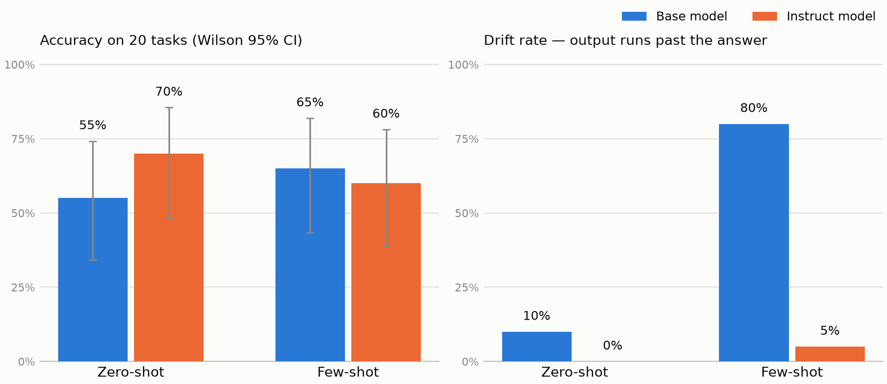

# Results: base vs instruct, zero-shot vs few-shot

Generated by `eval/report.py` — do not edit by hand. Regenerate with:

```
cd eval
python grade.py && python metrics.py && python report.py
```

Grading rules are documented in `eval/README.md`. Interpretation lives in `FINDINGS.md`; every number here is computed from `base_vs_instruct.json`.

> **Disclosure.** The grading pipeline in `eval/` and the cell-by-cell grading audit were built and run by an AI assistant (Claude) on my behalf, including the extraction rules and the hand-verification of all 80 graded cells. The model completions being graded, the task set, and the interpretation in `FINDINGS.md` are my own work. I state this so readers can weigh the methodology knowing who produced it.



## Headline metrics

| Condition | Accuracy | 95% CI | Drift | Repetition | Mean chars | Refusals | Empty |
|---|---|---|---|---|---|---|---|
| Instruct / zero-shot | **70%** (14/20) | 48%–86% | 0% | 0.00 | 245 | 1 | 0 |
| Base / few-shot | **65%** (13/20) | 43%–82% | 80% | 0.47 | 568 | 0 | 4 |
| Instruct / few-shot | **60%** (12/20) | 39%–78% | 5% | 0.05 | 107 | 0 | 0 |
| Base / zero-shot | **55%** (11/20) | 34%–74% | 10% | 0.03 | 153 | 0 | 4 |

Drift = output continues past the answer into self-generated Q/A pairs or template text. Repetition = mean fraction of duplicate lines per output. Refusal/empty counts are out of 20 tasks.

## Accuracy by category

| Category | Base / zero-shot | Base / few-shot | Instruct / zero-shot | Instruct / few-shot |
|---|---|---|---|---|
| arithmetic_word_problem | 0/1 | 0/1 | 0/1 | 0/1 |
| classification | 3/4 | 4/4 | 2/4 | 1/4 |
| code | 0/4 | 0/4 | 4/4 | 4/4 |
| extraction | 3/3 | 3/3 | 3/3 | 2/3 |
| logic | 1/4 | 3/4 | 2/4 | 2/4 |
| math | 4/4 | 3/4 | 3/4 | 3/4 |

Cell counts are small (3–4 tasks per category); read direction, not magnitude.

## Accuracy by difficulty

| Difficulty | Base / zero-shot | Base / few-shot | Instruct / zero-shot | Instruct / few-shot |
|---|---|---|---|---|
| easy | 4/6 | 5/6 | 3/6 | 4/6 |
| medium | 6/10 | 8/10 | 9/10 | 7/10 |
| hard | 1/4 | 0/4 | 2/4 | 1/4 |

## Head-to-head: which tasks flip

| Comparison | Only first correct | Only second correct | exact p |
|---|---|---|---|
| Instruction tuning (zero-shot) | Base / zero-shot: tasks [1, 9] | Instruct / zero-shot: tasks [6, 16, 17, 18, 19] | 0.4531 |
| Few-shot examples, base model | Base / zero-shot: tasks [4] | Base / few-shot: tasks [5, 6, 12] | 0.625 |
| Few-shot examples, instruct model | Instruct / zero-shot: tasks [4, 11, 15] | Instruct / few-shot: tasks [1] | 0.625 |
| Best base recipe vs best instruct recipe | Base / few-shot: tasks [1, 5, 9, 12] | Instruct / zero-shot: tasks [4, 16, 17, 18, 19] | 1.0 |

p is an exact two-sided McNemar/binomial test on the discordant tasks. With n=20 nothing here reaches significance; the task lists are the evidence, the p-values are honesty.

## Grading audit

Cells where extraction failed and a human should rule (`eval/overrides.json`): 6

- task 2, `instruct_few_shot` — extracted: `8.0`
- task 3, `instruct_few_shot` — extracted: `24.0`
- task 6, `base_zero_shot` — extracted: `None`
- task 9, `instruct_zero_shot` — extracted: `None`
- task 12, `base_zero_shot` — extracted: `None`
- task 12, `instruct_zero_shot` — extracted: `None`
